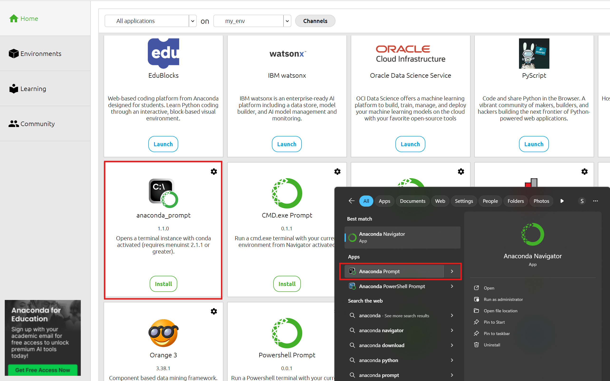

---
jupytext:
  formats: md:myst
  text_representation:
    extension: .md
    format_name: myst
    format_version: 0.13
    jupytext_version: 1.11.5
kernelspec:
  display_name: Python 3
  language: python
  name: python3
---


```{image} ../_static/images/anaconda_secondary_logo.svg
:alt: anaconda navigator
:class: bg-primary mb-1
:width: 200px
:align: center
```


# Python in Anaconda Navigator

Anaconda Navigator is a graphical user interface (GUI) designed to make managing Python projects and environments easier.

It simplifies package and environment management. Many scientific packages depend on specific versions of other packages, and Navigator helps manage these dependencies across multiple environments. 

Think of it like having different furniture in different rooms of the house: a kitchen will have a stove, an oven, and a variety of cooking appliances, while a bedroom will have a bed and a closet. 

In this case, you can build a working environment specifically for your machine learning projects with the latest Python version, pytorch, or tensorflow. You can also have a separate working environment to work with legacy code, maintaining older code and projects that do not support the latest python versions (e.g. deprecated syntax, packages and libraries that break with newer Python version,etc.).

Anaconda is available for Windows, Linux, and macOS.

## 1. Download and Install Anaconda Nagivator

Download and run the Anaconda Distribution installer from [here](https://www.anaconda.com/download/success)

As an 'all-in-one' toolbox, it will install the following applications: 
- Anaconda Navigator
- Anaconda Prompt: a command-line tool to run Python and manage Anaconda environments with conda commands.
- Anaconda Powershell Prompt: Same as Anaconda Prompt, but uses PowerShell for advanced Windows scripting capabilities.
- Jupyter Notebook: an interactive coding environment.
- Spyder: a Python IDE

## 2. Explore the Interface


The following applications can be launched from/installed on Anaconda Navigator and allow you to write Python code:
- [Jupyter Notebook](https://jupyter-notebook.readthedocs.io/en/latest/)
- [Jupyter Lab](https://jupyterlab.readthedocs.io/en/latest/) (more flexible than Jupyter Notebook; allows for file browsing and multiple panels.)
- [VSCode](https://www.anaconda.com/docs/tools/working-with-conda/ide-tutorials/vscode)
- [Spyder](https://www.anaconda.com/docs/tools/working-with-conda/ide-tutorials/spyder)
- [PyCharm](https://www.anaconda.com/docs/tools/working-with-conda/ide-tutorials/pycharm)


```{note}
You can launch RStudio from Anaconda Navigator!
```

## 3. Create your working environment


You can create a new environment through the Anaconda Navigator interface. Go to the Environments tab, and press the Create button. Choose a name for your environment, and select which Python version you want to work with.




Alternatively, you can do this through the Anaconda Prompt with conda commands. Conda is the package and environment manager that comes with Anaconda. 

You can find the prompt tool through your computer's search bar, or through the Anaconda Navigator.

```bash
conda create --name my_env python=3.13.2 
```


This will create a new environment named "my_env" with Python version 3.13.2 . 
Afterwards, you can activate this new environment and start working in it through the following command:

```bash
conda activate my_env 
```

You can find more useful commands in the conda documentation [here](https://docs.conda.io/projects/conda/en/latest/user-guide/cheatsheet.html).
You can also find tutorials on Anaconda Navigator on the [official website](https://www.anaconda.com/docs/tools/anaconda-navigator/tutorials/main).